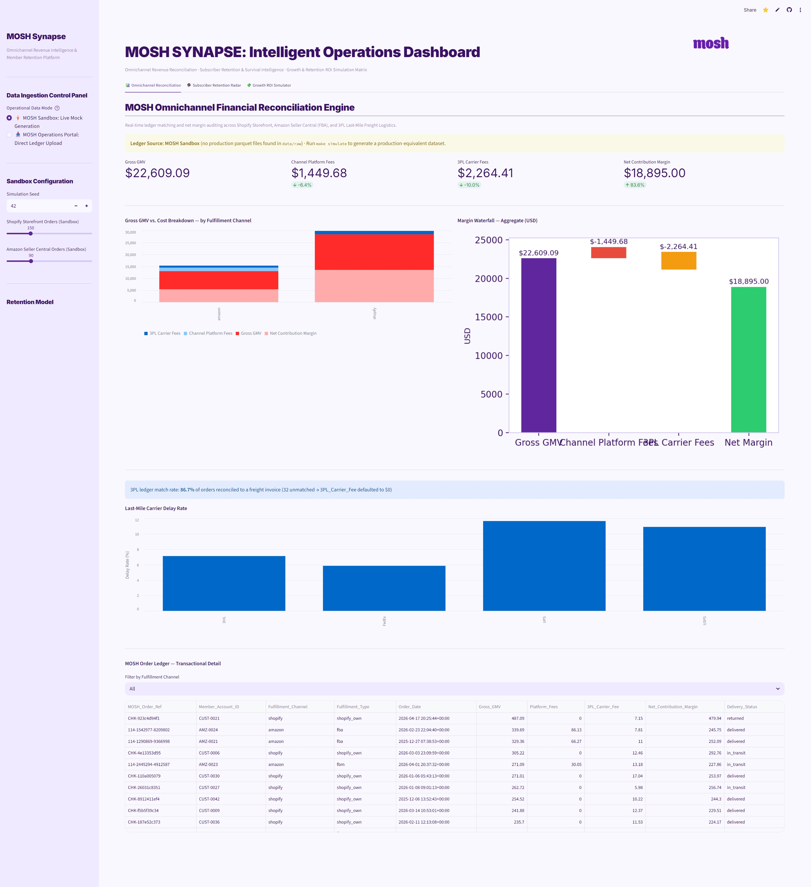
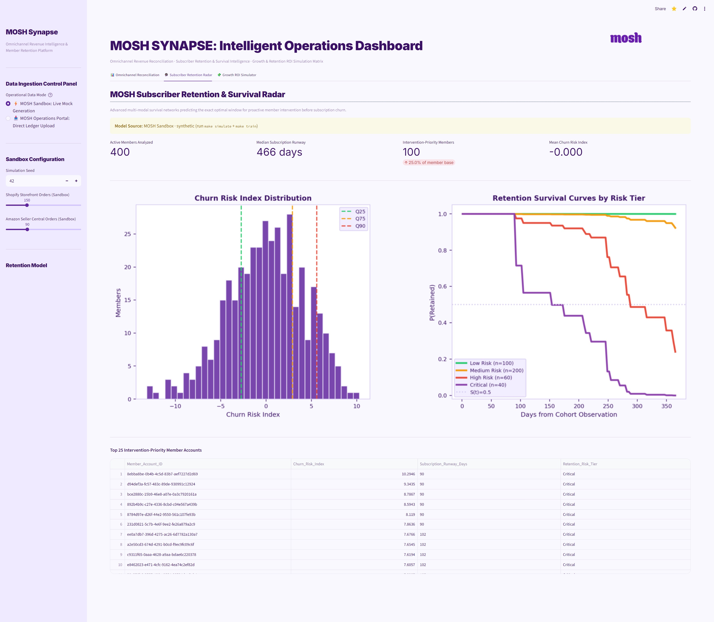
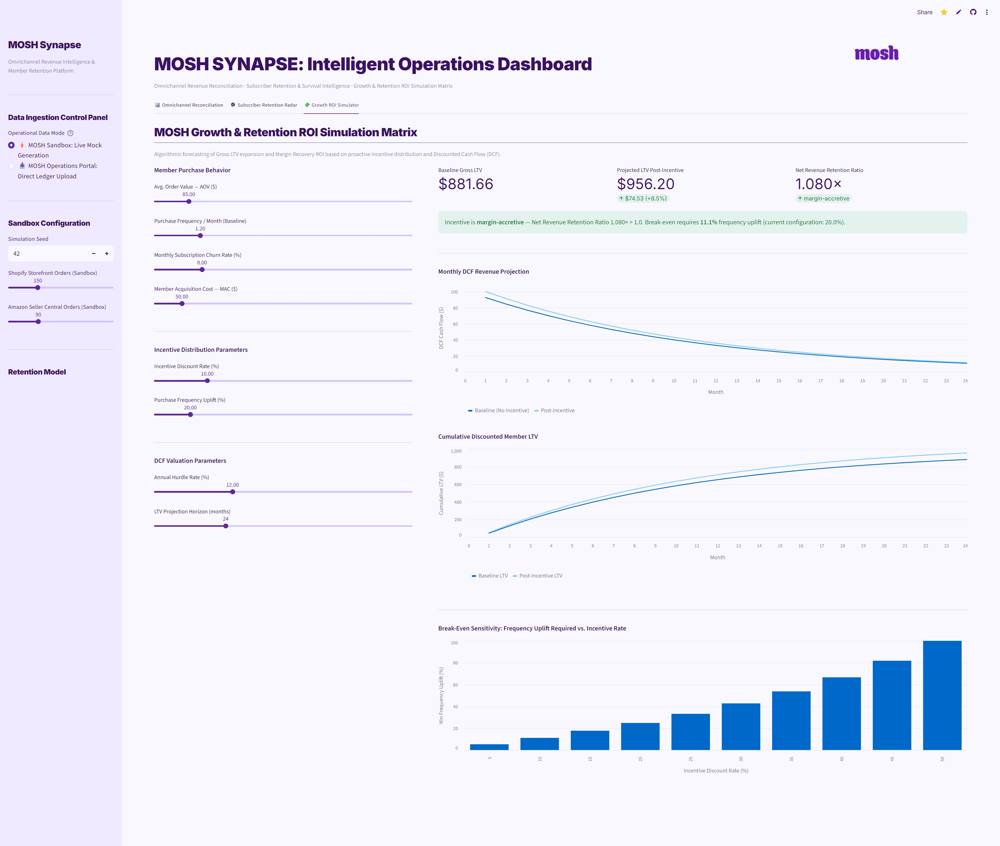

# MOSH SYNAPSE

> **Intelligent Omnichannel Operations Dashboard**  
> Multi-Source Revenue Reconciliation · Subscriber Retention & Survival Intelligence · Growth ROI Simulation

Live demo: [mosh-synapse.streamlit.app](https://dashboardpy-zixanuxvfqyht829ksb62d.streamlit.app)

---

## What It Does

MOSH SYNAPSE is an executive-facing internal analytics platform built for the MOSH e-commerce and supply chain team. It ingests order data from Shopify Storefront, Amazon Seller Central (FBA/FBM), and 3PL last-mile freight logistics, reconciles them into a unified ledger, and layers on a survival analysis churn model with a DCF-based LTV simulator.

**Three operational tabs:**

| Tab | Function |
|---|---|
| 📊 Omnichannel Reconciliation | Real-time ledger matching across Shopify, Amazon, and 3PL — gross GMV, platform fees, carrier costs, and net contribution margin |
| 🔮 Subscriber Retention Radar | CoxPH survival model scoring every member account with a Churn Risk Index, subscription runway, and risk tier (Low / Medium / High / Critical) |
| 💸 Growth ROI Simulator | DCF LTV calculator — model the financial impact of coupon interventions with 8 live sliders, break-even sensitivity chart, and margin-accretion signal |

---

## Screenshots

**Tab 1 — Omnichannel Financial Reconciliation Engine**


**Tab 2 — Subscriber Retention & Survival Radar**


**Tab 3 — Growth & Retention ROI Simulation Matrix**


---

## Architecture

```
┌─────────────────────────────────────────────────────────────────────────┐
│                          MOSH SYNAPSE Pipeline                          │
│                                                                         │
│  ┌───────────────────┐    ┌──────────────────┐    ┌──────────────────┐  │
│  │  Data Ingestion   │    │ Feature Pipeline │    │  Survival Model  │  │
│  │                   │    │                  │    │                  │  │
│  │  ShopifyWebhook   │    │  RFMExtractor    │    │  CoxPHModel      │  │
│  │  AmazonOrder      │───▶│  Behavioral      │───▶│  (scikit-        │  │
│  │  3PLInvoice       │    │  Ticket          │    │   survival)      │  │
│  │                   │    │  Customer        │    │                  │  │
│  │  MultiSource      │    │  + StandardScaler│    │  MLflow Registry │  │
│  │  Aggregator       │    │  + MedianImputer │    │                  │  │
│  └───────────────────┘    └──────────────────┘    └────────┬─────────┘  │
│          │                        │                        │            │
│          ▼                        ▼                        ▼            │
│  ┌───────────────────┐    ┌──────────────────┐    ┌──────────────────┐  │
│  │  Great            │    │  MLflow Tracking │    │  MOSH SYNAPSE    │  │
│  │  Expectations     │    │  + k-Fold CV     │    │  Streamlit       │  │
│  │  Validation       │    │  (C-index, IBS,  │    │  Dashboard       │  │
│  │  (4 suites)       │    │   Brier, td-AUC) │    │                  │  │
│  └───────────────────┘    └──────────────────┘    └──────────────────┘  │
│                                                                         │
│  ┌───────────────────┐    ┌──────────────────┐    ┌──────────────────┐  │
│  │  FastAPI          │    │  Evidently AI    │    │  Docker          │  │
│  │  Serving Layer    │    │  Drift Monitor   │    │  docker-compose  │  │
│  └───────────────────┘    └──────────────────┘    └──────────────────┘  │
└─────────────────────────────────────────────────────────────────────────┘
```

---

## Repository Layout

```
chrono-ltv/
├── .streamlit/
│   └── config.toml             # MOSH brand theme (purple palette, Inter font)
├── conf/                       # Hydra configs (data, model, mlflow, serving)
├── data/
│   ├── raw/                    # Parquet output of the simulator (gitignored)
│   ├── processed/              # Feature-engineered data
│   ├── reference/              # Evidently reference datasets
│   └── expectations/           # Great Expectations suites
├── docker/
│   └── docker-compose.yml
├── docs/
│   └── audit.md                # Full technical audit of the platform
├── scripts/
│   ├── generate_data.py        # Simulate 5 parquet files (customers, transactions, …)
│   ├── train.py                # Train CoxPH + register in MLflow
│   └── monitor.py              # Run Evidently drift report
├── src/chrono_ltv/
│   ├── data/
│   │   ├── simulator.py        # EcommerceSimulator (Faker + noise injection)
│   │   ├── schemas.py          # Pydantic schemas for simulator output
│   │   └── validators.py       # Great Expectations DataValidator
│   ├── data_ingestion/
│   │   ├── schemas.py          # ShopifyWebhookPayload, AmazonOrderReport, Logistics3PLInvoice
│   │   ├── aggregator.py       # MultiSourceAggregator → unified order ledger
│   │   └── validators.py       # IngestionValidator (4 GE suites + join integrity check)
│   ├── features/
│   │   ├── encoders.py         # RFM, Behavioral, Ticket, Customer extractors
│   │   └── pipeline.py         # FeaturePipeline (impute → scale → structured y)
│   ├── models/
│   │   ├── base.py             # SurvivalModel ABC
│   │   ├── cox_ph.py           # CoxPHModel (sksurv wrapper, alpha=0.5, breslow ties)
│   │   ├── xgb_survival.py     # XGBoost-AFT wrapper
│   │   └── deepsurv.py         # DeepSurv (PyTorch, optional)
│   ├── training/
│   │   ├── trainer.py          # SurvivalTrainer — StratifiedKFold CV + MLflow logging
│   │   └── evaluator.py        # C-index, IBS, time-dependent AUC, Brier scores
│   ├── serving/
│   │   ├── api.py              # FastAPI app
│   │   ├── predictor.py        # Model loading + inference
│   │   └── schemas.py          # Request / response Pydantic models
│   ├── monitoring/
│   │   ├── drift.py            # Evidently DataDriftPreset report
│   │   └── alerts.py           # Threshold-based alerting
│   ├── utils/
│   │   ├── io.py               # load_parquet / save_parquet
│   │   └── logging.py          # Loguru configuration
│   └── dashboard.py            # MOSH SYNAPSE Streamlit app (entry point)
├── tests/
│   ├── unit/
│   │   ├── test_ingestion.py   # 50 tests — schemas, aggregator, validators
│   │   ├── test_schemas.py
│   │   ├── test_simulator.py
│   │   ├── test_validators.py
│   │   ├── test_features.py
│   │   ├── test_models.py
│   │   ├── test_training.py
│   │   ├── test_serving.py
│   │   └── test_monitoring.py
│   ├── integration/
│   └── behavioral/
│       ├── test_invariance.py
│       ├── test_directional.py
│       └── test_minimum_functionality.py
├── requirements.txt            # Streamlit Cloud deployment deps (no self-ref extras)
├── pyproject.toml
└── Makefile
```

---

## Quick Start

```bash
# 1. Clone and create virtual environment
git clone https://github.com/dingonewen/chrono-ltv.git
cd chrono-ltv
python -m venv .venv
.venv\Scripts\activate        # Windows
# source .venv/bin/activate   # macOS / Linux

# 2. Install with all pipeline extras
pip install -e ".[dashboard,survival,features,mlops]"

# 3. Generate synthetic data
make simulate

# 4. Train the retention model and register in MLflow
make train

# 5. Launch the dashboard
make dashboard
# → http://localhost:8501
```

---

## Data Pipeline

### Step 1 — Generate Data (`make simulate`)

Runs `EcommerceSimulator` and writes five Parquet files to `data/raw/`:

| File | Rows (default) | Description |
|---|---|---|
| `customers.parquet` | 10,000 | Demographics, loyalty tier, acquisition channel |
| `transactions.parquet` | ~80,000 | Orders with RFM-ready fields |
| `clickstream.parquet` | ~200,000 | Session / page / device events |
| `support_tickets.parquet` | ~15,000 | Ticket topics, sentiment scores, resolution |
| `survival_labels.parquet` | 10,000 | `event_observed` (bool) + `duration_days` (float) |

### Step 2 — Train (`make train`)

Runs `scripts/train.py`:
1. Loads all five Parquet files
2. Runs `FeaturePipeline(scale=True).fit_transform(…)` — RFM + behavioral + ticket + customer features, median imputation, StandardScaler
3. Fits `CoxPHModel(alpha=0.5, ties="breslow")` with `StratifiedKFold(n_splits=5)` CV
4. Logs `c_index`, `ibs`, `brier_<t>d`, `td_auc_<t>d` per fold to MLflow
5. Trains final model on full dataset, registers as `"chrono-ltv-cox"` with tag `training_mode=final`

### Step 3 — Serve Dashboard (`make dashboard`)

The dashboard loads data in this priority order:

**Tab 1 — Reconciliation:**
```
data/raw/transactions.parquet  →  mapped to unified order schema
↓ (if missing)
MultiSourceAggregator synthetic generation (seeded, in-memory)
```

**Tab 2 — Retention Radar:**
```
MLflow registry ("chrono-ltv-cox", training_mode=final tag)
  + data/raw/*.parquet feature matrix
↓ (no MLflow model)
Fresh CoxPH fit on real parquet data
↓ (no parquets)
Full synthetic fallback (EcommerceSimulator in-memory)
```

---

## Data Ingestion — Multi-Source Schema

### `ShopifyWebhookPayload`
Key fields: `checkout_id` (join key), `total_price`, `total_discounts`, `financial_status` (paid/pending/refunded/partially_refunded/voided), `fulfillment_status`, `marketing_tags` (UTM/attribution), `line_item_count`

Validators: finite price check, `updated_at >= created_at` cross-field constraint.

### `AmazonOrderReport`
Key fields: `amazon_order_id` (join key), `fulfillment_channel` (AFN=FBA / MFN=FBM), `fba_fee`, `referral_fee`, `total_amazon_fees` property, `order_status` (5-value enum)

### `Logistics3PLInvoice`
Key fields: `order_reference` (matches `checkout_id` or `amazon_order_id`), `zone` (1–8), `base_rate`, `fuel_surcharge`, `residential_surcharge`, `total_charge`

Computed properties: `volumetric_weight_lbs = (L × W × H) / 139`, `billable_weight_lbs = max(actual, volumetric)`

### `MultiSourceAggregator` Join Logic
```
net_contribution_margin = gross_revenue − platform_fees − shipping_cost
```
- Shopify `platform_fees = 0` (no per-order take rate)
- Amazon `platform_fees = fba_fee + referral_fee`
- 3PL joined on `universal_order_id` via LEFT JOIN; unmatched rows → `shipping_cost = 0`

---

## Survival Model

**Algorithm:** `sksurv.linear_model.CoxPHSurvivalAnalysis`
- `alpha = 0.5` (L2 / Tikhonov regularisation)
- `ties = "breslow"`
- `n_iter = 100`, `tol = 1e-9`

**Risk score:** linear predictor `Xβ` (log-hazard ratio relative to baseline)

**Risk tiers** (quantile-based):

| Tier | Quantile | Color |
|---|---|---|
| Low Risk | ≤ Q25 | `#2ECC71` |
| Medium Risk | Q25 – Q75 | `#F39C12` |
| High Risk | Q75 – Q90 | `#E74C3C` |
| Critical | > Q90 | `#8E44AD` |

---

## DCF LTV Formula (Tab 3)

```
survival[t]         = (1 − p_churn) ^ t
discount_factor[t]  = (1 + r_monthly) ^ t

baseline_dcf[t]     = AOV × freq × survival[t] / discount_factor[t]
coupon_dcf[t]       = AOV × (1 − coupon_rate) × freq × (1 + freq_lift) × survival[t] / discount_factor[t]

LTV_baseline        = Σ baseline_dcf − MAC
LTV_coupon          = Σ coupon_dcf   − MAC

net_rev_ratio       = (1 − coupon_rate) × (1 + freq_lift)
break_even_lift     = coupon_rate / (1 − coupon_rate)   [as a %]
```

Incentive is **margin-accretive** when `net_rev_ratio ≥ 1.0`.

---

## Deployment

### Streamlit Community Cloud

1. Push branch to GitHub
2. Go to [share.streamlit.io](https://share.streamlit.io) → New app
3. Set **Main file path:** `src/chrono_ltv/dashboard.py`
4. Deploy — the dashboard runs in `⚡ MOSH Sandbox` mode (no parquets needed)

### Docker (with real data)

```bash
make docker-build
make docker-up
# dashboard → http://localhost:8501
```

### Local (full pipeline)

```bash
make simulate    # generate data/raw/*.parquet
make train       # fit + register model in mlruns/
make dashboard   # load real data + MLflow model
```

---

## Make Targets

| Target | Command | Description |
|---|---|---|
| `make simulate` | `python scripts/generate_data.py` | Generate synthetic Parquet files |
| `make train` | `python scripts/train.py` | Train CoxPH + register in MLflow |
| `make dashboard` | `streamlit run src/chrono_ltv/dashboard.py` | Launch MOSH SYNAPSE |
| `make serve` | `uvicorn … --port 8000` | Start FastAPI prediction server |
| `make monitor` | `python scripts/monitor.py` | Run Evidently drift report |
| `make test` | `pytest tests/ -v` | Full test suite (276 tests, 65% coverage) |
| `make test-unit` | `pytest tests/unit -v` | Unit tests only |
| `make test-behavioral` | `pytest tests/behavioral -v` | Invariance + directional tests |
| `make lint` | `ruff check + format --check` | Lint and format check |
| `make type-check` | `mypy src/` | Static type checking |
| `make docker-up` | `docker-compose up` | Start full stack in Docker |

---

## Tech Stack

| Concern | Library |
|---|---|
| Dashboard | `Streamlit`, `Matplotlib` |
| Survival Analysis | `scikit-survival`, `XGBoost`, `PyTorch` (optional) |
| Feature Engineering | `scikit-learn` (ColumnTransformer, StandardScaler, SimpleImputer) |
| Data Validation | `Great Expectations ≥ 1.0` (ephemeral context) |
| Drift Monitoring | `Evidently AI` (DataDriftPreset) |
| Experiment Tracking | `MLflow ≥ 2.13` |
| Serving | `FastAPI` + `Uvicorn` |
| Data Schemas | `Pydantic v2` |
| Simulation | `Faker`, `NumPy`, `Pandas` |
| Containerisation | `Docker` + `docker-compose` |
| Testing | `pytest`, `pytest-cov`, `pytest-asyncio` |
| Linting | `Ruff` |
| Type Checking | `Mypy` (strict mode) |

---

## Test Coverage

```
276 passed · 1 skipped (torch not installed) · coverage 65.13%
```

Key test modules: `test_ingestion.py` (50 tests covering all three Pydantic schemas, `MultiSourceAggregator`, `IngestionValidator`, and cross-stream join integrity), `test_behavioral/` (invariance, directional, and minimum functionality tests for the survival model).

---

## Future Development Roadmap

> **Current status: Prototype** — MOSH SYNAPSE is a fully functional proof-of-concept built on synthetic data and flat Parquet files. The architecture, model pipeline, and dashboard are production-grade in design; the items below represent the path from prototype to a hardened, self-service internal platform once access to real MOSH operational data is confirmed.

### Infrastructure & Data Layer
- **Cloud deployment on real infrastructure** — migrate from Streamlit Community Cloud to a scalable cloud host (AWS / GCP / Azure) capable of handling the full volume of live Shopify, Amazon, and 3PL data streams
- **Persistent database backend** — replace Parquet flat files with a proper database (e.g., PostgreSQL or a data warehouse like BigQuery / Redshift) for transactional integrity, concurrent access, and historical querying
- **Native multi-format ingestion** — extend the ingestion layer to handle all upstream data types natively: JSON webhook payloads (Shopify), flat-file CSVs (Amazon Seller Central reports), EDI/XML invoices (3PL carriers), and REST API polling schedules

### Robustness & Operability
- **Production-grade data wrangling** — add schema normalization, deduplication logic, and field-level reconciliation rules to handle the messiness of real omnichannel order data (partial shipments, split orders, currency conversions, refund cascades)
- **Comprehensive error handling & alerting** — wrap all ingestion, transformation, and model inference paths with structured error handling, automatic retries, and Slack / email alerts on pipeline failures, so the platform runs with near-zero manual intervention
- **Self-service operations for non-technical stakeholders** — simplify the operational interface so senior team members with no engineering background can upload data, trigger model refreshes, and pull reports without any command-line or code access

### AI & Analytics Extensions
- **LLM-powered insight agent** — integrate the Claude API to embed a conversational analytics assistant directly in the dashboard, allowing stakeholders to ask plain-English questions about revenue trends, churn risk, and campaign ROI and receive grounded, data-backed answers in real time
- **Extended visualization suite** — add cohort retention heatmaps, geographic carrier performance maps, time-series GMV decomposition, and interactive funnel charts beyond the current static Matplotlib figures
- **One-click presentation export** — generate boardroom-ready PDF / PowerPoint reports from any dashboard state, including live KPIs, survival curves, and LTV simulation outputs, directly from the UI

### Model & Platform Evolution
- **Live model retraining on real data** — validate and retune the CoxPH survival model against actual MOSH subscriber churn events; benchmark against XGBoost-AFT and DeepSurv once real labels are available
- **Advanced AI agent orchestration** — as the AI agent ecosystem matures, evaluate and deploy the most robust, reliable, and cost-efficient agentic frameworks (multi-step reasoning, tool use, autonomous monitoring) to further reduce manual analytical overhead and surface insights proactively
